# Staff Management System - Complete UML Class Diagram

## Complete Staff Management System - All Classes

```mermaid
classDiagram
    %% ============================================
    %% STAFF HIERARCHY (Core Entities)
    %% ============================================
    
    class Staff {
        <<abstract>>
        -String id
        -String name
        -String email
        -String phoneNumber
        -DateTime joinDate
        -String department
        +String role*
        +toJson() Map~String, dynamic~
    }
    
    class Doctor {
        -String specialization
        -String licenseNumber
        -List~String~ _appointmentIds
        -List~String~ _qualifications
        +List~String~ appointmentIds
        +List~String~ qualifications
        +String role = "Doctor"
        +addAppointment(appointmentId) void
        +removeAppointment(appointmentId) void
        +addQualification(qualification) void
        +toJson() Map~String, dynamic~
    }
    
    class Nurse {
        -String ward
        -String shift
        -List~String~ _specialties
        +List~String~ specialties
        +String role = "Nurse"
        +addSpecialty(specialty) void
        +toJson() Map~String, dynamic~
    }
    
    class Administrative {
        -String position
        -List~String~ _responsibilities
        +List~String~ responsibilities
        +String role = "Administrative"
        +addResponsibility(responsibility) void
        +toJson() Map~String, dynamic~
    }
    
    %% ============================================
    %% PATIENT (Related to Staff)
    %% ============================================
    
    class Patient {
        -String id
        -String name
        -DateTime dateOfBirth
        -String gender
        -String bloodType
        -List~String~ _appointmentIds
        -List~String~ _prescriptionIds
        -List~String~ _medicalHistory
        -List~String~ _allergies
        +int age
        +addAppointment(appointmentId) void
        +addPrescription(prescriptionId) void
        +fromJson(json) Patient
        +toJson() Map~String, dynamic~
    }
    
    %% ============================================
    %% APPOINTMENT (Links Doctor & Patient)
    %% ============================================
    
    class Appointment {
        -String id
        -String patientId
        -String doctorId
        -DateTime scheduledTime
        -DateTime? actualStartTime
        -DateTime? actualEndTime
        -String reason
        -AppointmentStatus status
        -String? notes
        -String appointmentType
        +bool isUpcoming
        +bool isPast
        +startAppointment() void
        +complete() void
        +cancel() void
        +fromJson(json) Appointment
        +toJson() Map~String, dynamic~
    }
    
    class AppointmentStatus {
        <<enumeration>>
        SCHEDULED
        IN_PROGRESS
        COMPLETED
        CANCELLED
        NO_SHOW
    }
    
    %% ============================================
    %% PRESCRIPTION (Created by Doctor)
    %% ============================================
    
    class Prescription {
        -String id
        -String patientId
        -String doctorId
        -DateTime issueDate
        -String diagnosis
        -List~Medication~ items
        -double totalCost
        -String instructions
        -DateTime? followUpDate
        -bool _isFilled
        +bool isValid
        +fromJson(json) Prescription
        +toJson() Map~String, dynamic~
    }
    
    class Medication {
        -String name
        -String dosage
        -String frequency
        -String? notes
        -double cost
        -bool isValid
        +String dosageDescription
        +fromJson(json) Medication
        +toJson() Map~String, dynamic~
    }
    
    %% ============================================
    %% REPOSITORY INTERFACES
    %% ============================================
    
    class IStaffRepository {
        <<interface>>
        +addStaff(staff) Future~void~
        +getStaffById(id) Future~Staff?~
        +getStaffByRole(role) Future~List~Staff~~
        +getAllStaff() Future~List~Staff~~
        +updateStaff(staff) Future~void~
        +deleteStaff(id) Future~bool~
    }
    
    class IPatientRepository {
        <<interface>>
        +addPatient(patient) Future~void~
        +getPatientById(id) Future~Patient?~
        +getAllPatients() Future~List~Patient~~
        +updatePatient(patient) Future~void~
        +searchPatients(query) Future~List~Patient~~
    }
    
    class IAppointmentRepository {
        <<interface>>
        +scheduleAppointment(appointment) Future~void~
        +getAppointmentById(id) Future~Appointment?~
        +getAppointmentsByDoctor(doctorId) Future~List~Appointment~~
        +getAppointmentsByPatient(patientId) Future~List~Appointment~~
        +updateAppointment(appointment) Future~void~
    }
    
    class IPrescriptionRepository {
        <<interface>>
        +addPrescription(prescription) Future~void~
        +getPrescriptionById(id) Future~Prescription?~
        +getPrescriptionsByDoctor(doctorId) Future~List~Prescription~~
        +getPrescriptionsByPatient(patientId) Future~List~Prescription~~
    }
    
    %% ============================================
    %% REPOSITORY IMPLEMENTATIONS
    %% ============================================
    
    class StaffRepository {
        -Map~String, Staff~ _staffStorage
        -String _filePath
        -bool _isLoaded
        -_loadData() Future~void~
        -_ensureLoaded() Future~void~
        -_fromJson(json) Staff
        -_saveData() Future~void~
        +addStaff(staff) Future~void~
        +getStaffById(id) Future~Staff?~
        +getStaffByRole(role) Future~List~Staff~~
        +getAllStaff() Future~List~Staff~~
        +updateStaff(staff) Future~void~
        +deleteStaff(id) Future~bool~
    }
    
    class PatientRepository {
        -Map~String, Patient~ _patientStorage
        -String _filePath
        -_loadData() Future~void~
        -_saveData() Future~void~
        +addPatient(patient) Future~void~
        +getPatientById(id) Future~Patient?~
        +getAllPatients() Future~List~Patient~~
        +updatePatient(patient) Future~void~
        +searchPatients(query) Future~List~Patient~~
    }
    
    class AppointmentRepository {
        -Map~String, Appointment~ _appointmentStorage
        -String _filePath
        -_loadData() Future~void~
        -_saveData() Future~void~
        +scheduleAppointment(appointment) Future~void~
        +getAppointmentById(id) Future~Appointment?~
        +getAppointmentsByDoctor(doctorId) Future~List~Appointment~~
        +updateAppointment(appointment) Future~void~
    }
    
    class PrescriptionRepository {
        -Map~String, Prescription~ _prescriptionStorage
        -String _filePath
        -_loadData() Future~void~
        -_saveData() Future~void~
        +addPrescription(prescription) Future~void~
        +getPrescriptionById(id) Future~Prescription?~
        +getPrescriptionsByDoctor(doctorId) Future~List~Prescription~~
    }
    
    %% ============================================
    %% SERVICE LAYER
    %% ============================================
    
    class HospitalService {
        -IStaffRepository _staffRepository
        -IPatientRepository _patientRepository
        -IAppointmentRepository _appointmentRepository
        -IPrescriptionRepository _prescriptionRepository
        +hireStaff(staff) Future~void~
        +getDoctors() Future~List~Doctor~~
        +getNurses() Future~List~Nurse~~
        +getStaffById(id) Future~Staff?~
        +scheduleAppointment(...) Future~Appointment~
        +createPrescription(...) Future~Prescription~
        +getDoctorPerformance(doctorId) Future~Map~
    }
    
    %% ============================================
    %% UI LAYER
    %% ============================================
    
    class ConsoleUI {
        -HospitalService _hospitalService
        +run() Future~void~
        -_manageStaff() Future~void~
        -_hireDoctor() Future~void~
        -_hireNurse() Future~void~
        -_viewAllDoctors() Future~void~
        -_viewAllNurses() Future~void~
        -_searchStaff() Future~void~
    }
    
    %% ============================================
    %% RELATIONSHIPS - Staff Hierarchy
    %% ============================================
    
    Staff <|-- Doctor : extends
    Staff <|-- Nurse : extends
    Staff <|-- Administrative : extends
    
    %% ============================================
    %% RELATIONSHIPS - Entities
    %% ============================================
    
    Doctor "1" --> "0..*" Appointment : conducts
    Patient "1" --> "0..*" Appointment : attends
    Appointment --> AppointmentStatus : has status
    
    Doctor "1" --> "0..*" Prescription : writes
    Patient "1" --> "0..*" Prescription : receives
    Prescription "1" *-- "1..*" Medication : contains
    
    %% ============================================
    %% RELATIONSHIPS - Repository Pattern
    %% ============================================
    
    IStaffRepository <|.. StaffRepository : implements
    IPatientRepository <|.. PatientRepository : implements
    IAppointmentRepository <|.. AppointmentRepository : implements
    IPrescriptionRepository <|.. PrescriptionRepository : implements
    
    StaffRepository --> Staff : manages
    PatientRepository --> Patient : manages
    AppointmentRepository --> Appointment : manages
    PrescriptionRepository --> Prescription : manages
    
    %% ============================================
    %% RELATIONSHIPS - Service Layer
    %% ============================================
    
    HospitalService --> IStaffRepository : uses
    HospitalService --> IPatientRepository : uses
    HospitalService --> IAppointmentRepository : uses
    HospitalService --> IPrescriptionRepository : uses
    
    HospitalService ..> Doctor : creates
    HospitalService ..> Nurse : creates
    HospitalService ..> Appointment : creates
    HospitalService ..> Prescription : creates
    
    %% ============================================
    %% RELATIONSHIPS - UI Layer
    %% ============================================
    
    ConsoleUI --> HospitalService : uses
    
    %% ============================================
    %% NOTES
    %% ============================================
    
    note for Staff "Abstract base class\nDefines common attributes\nfor all hospital staff"
    
    note for Doctor "Manages specializations,\nlicenses, appointments,\nand qualifications"
    
    note for StaffRepository "Solves async loading with\n_ensureLoaded() mechanism\nPolymorphic deserialization"
    
    note for HospitalService "Orchestrates all operations\nValidates business rules\nCoordinates repositories"
```

## Key Components for Staff Management

### **1. Staff Entities (Domain Layer)**
- `Staff` (abstract) - Base class for all staff
- `Doctor` - Specialization, license, appointments, qualifications
- `Nurse` - Ward, shift, specialties
- `Administrative` - Position, responsibilities

### **2. Related Entities**
- `Patient` - For appointments and prescriptions
- `Appointment` - Links Doctor ↔ Patient
- `AppointmentStatus` - Enum for appointment states
- `Prescription` - Created by Doctor for Patient
- `Medication` - Items within Prescription

### **3. Repository Interfaces**
- `IStaffRepository` - Staff data operations
- `IPatientRepository` - Patient data operations
- `IAppointmentRepository` - Appointment data operations
- `IPrescriptionRepository` - Prescription data operations

### **4. Repository Implementations**
- `StaffRepository` - JSON persistence with async loading
- `PatientRepository` - Patient data management
- `AppointmentRepository` - Appointment data management
- `PrescriptionRepository` - Prescription data management

### **5. Service Layer**
- `HospitalService` - Orchestrates all staff operations

### **6. UI Layer**
- `ConsoleUI` - User interface for staff management

## Relationships Explained

### **Inheritance:**
- `Doctor`, `Nurse`, `Administrative` extend `Staff`

### **Composition:**
- `Prescription` contains `Medication` items (strong ownership)

### **Association:**
- `Doctor` conducts `Appointments` (0..* cardinality)
- `Doctor` writes `Prescriptions` (0..* cardinality)
- `Patient` attends `Appointments` (0..* cardinality)
- `Patient` receives `Prescriptions` (0..* cardinality)

### **Dependency:**
- `HospitalService` depends on repository interfaces
- `ConsoleUI` depends on `HospitalService`

### **Implementation:**
- Repository implementations implement repository interfaces

## Complete Staff Management Flow

```
ConsoleUI 
    ↓
HospitalService
    ↓
IStaffRepository (interface)
    ↓
StaffRepository (implementation)
    ↓
Staff/Doctor/Nurse/Admin (entities)
    ↓
JSON Files
```

This diagram shows **ALL classes** needed to perform complete staff management operations including hiring, viewing, scheduling appointments, and creating prescriptions!

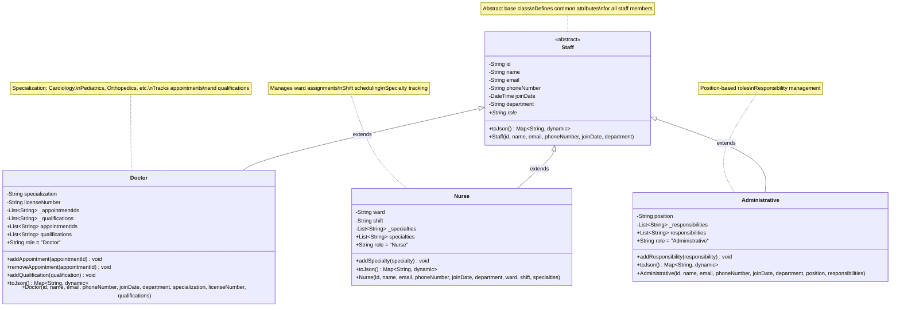

## 2. Staff Repository Pattern

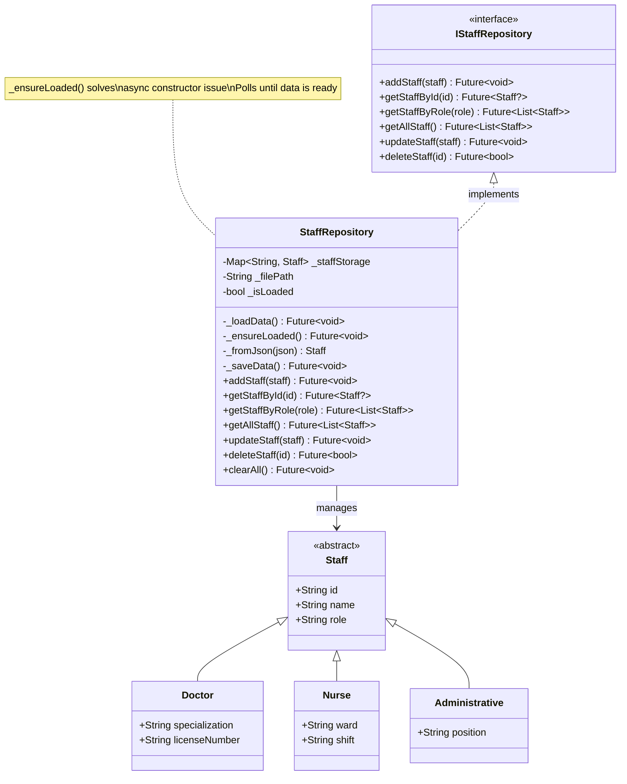

## 3. Staff Management Service Layer

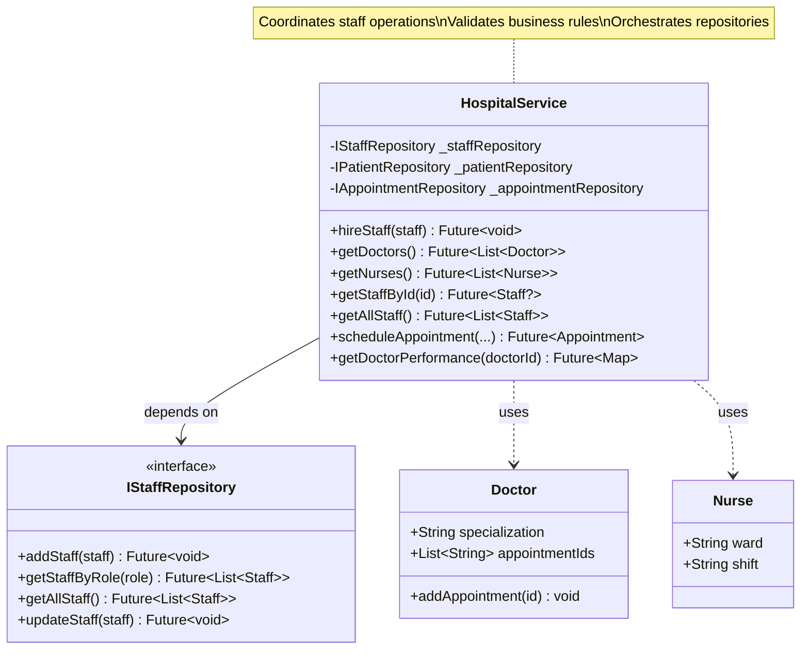

## 4. Staff Management Data Flow

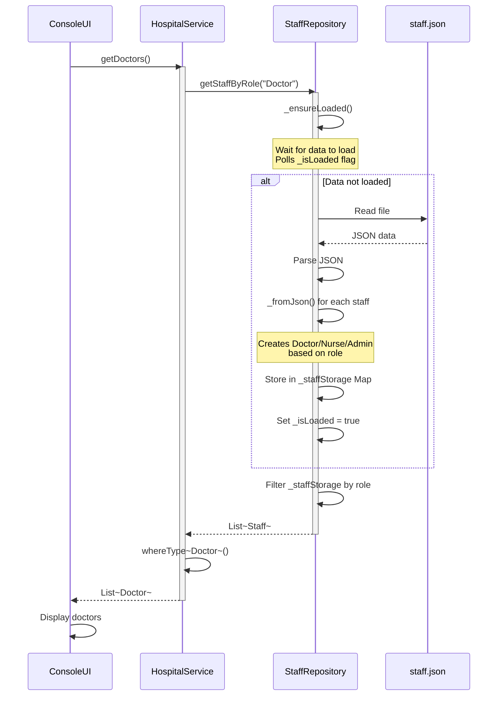

## 5. Staff Hiring Workflow

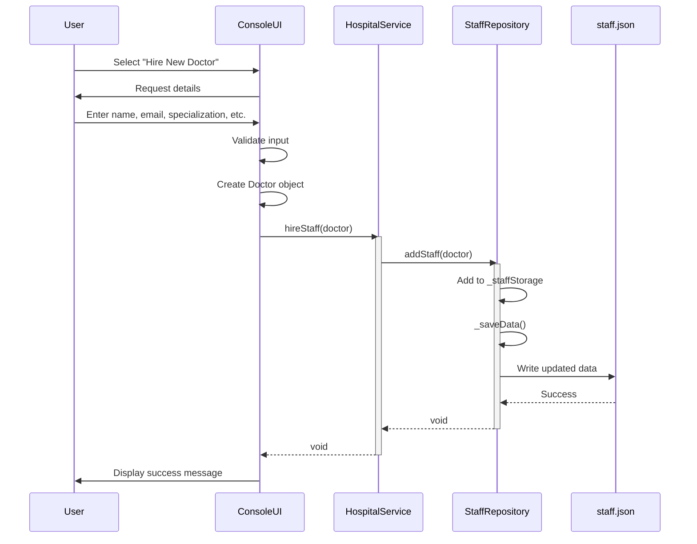

## 6. Staff Search and Filter

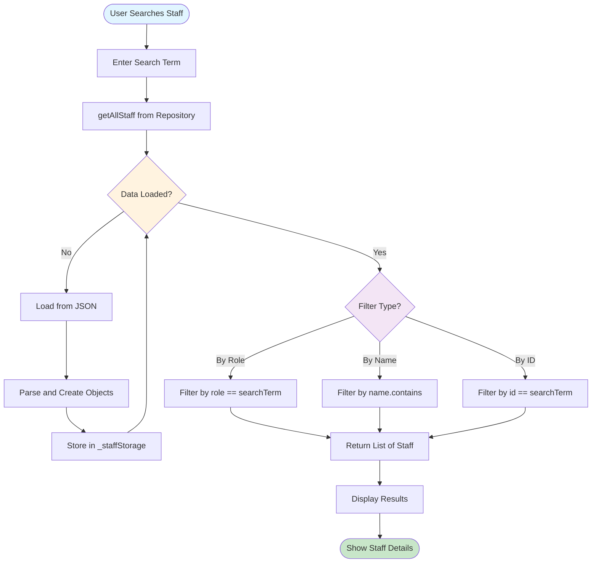

## 7. Staff-Appointment Relationship

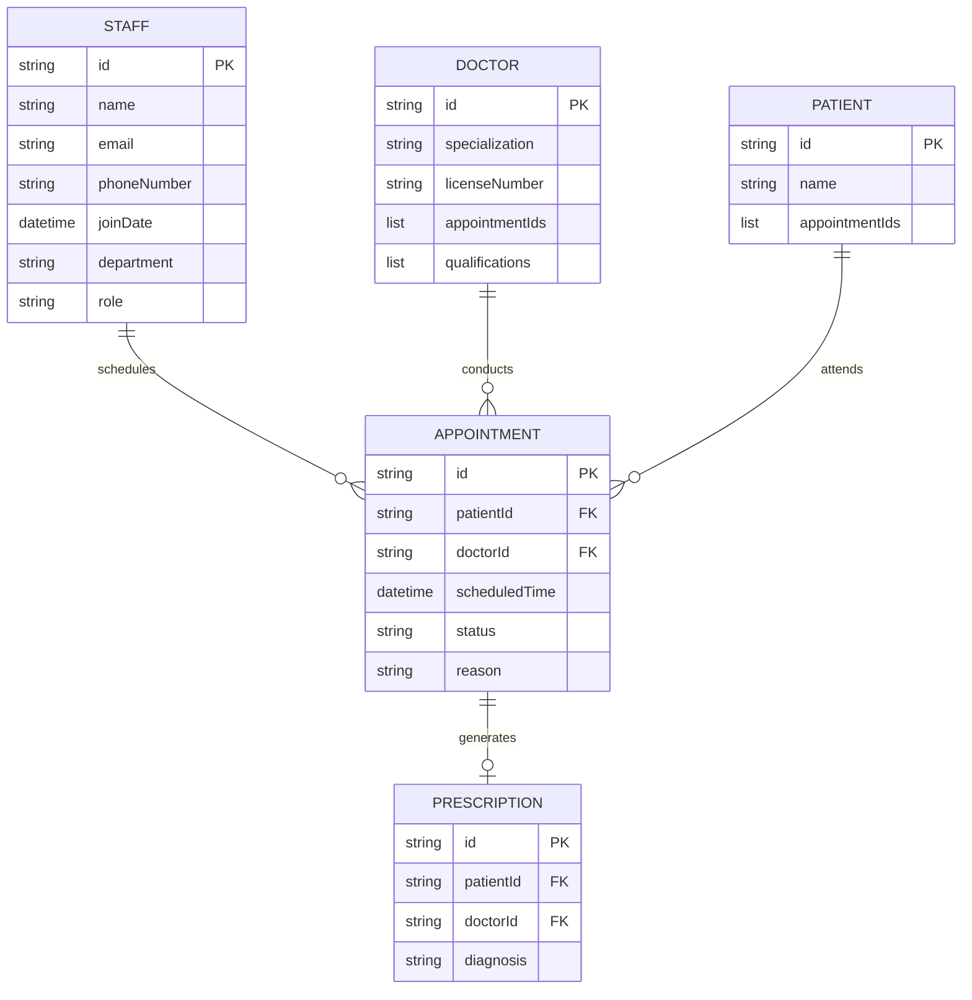

## 8. Staff State Management

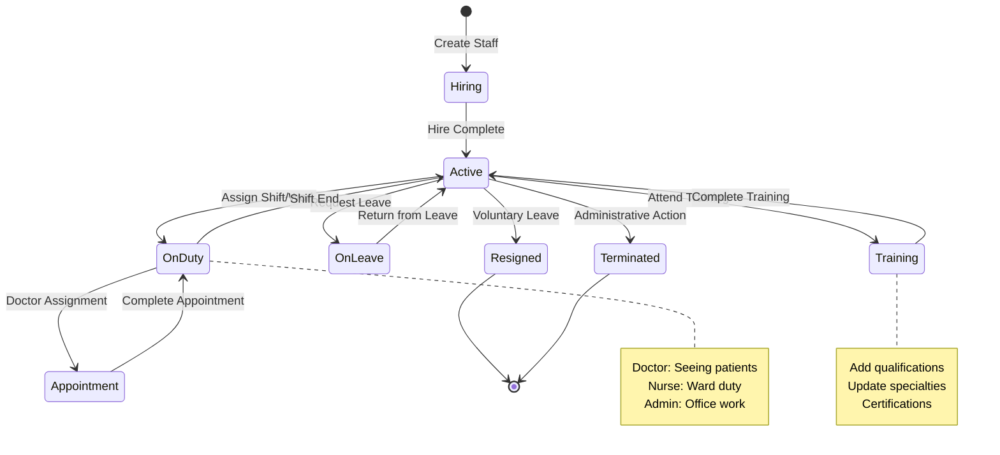

## 9. Staff Data Persistence

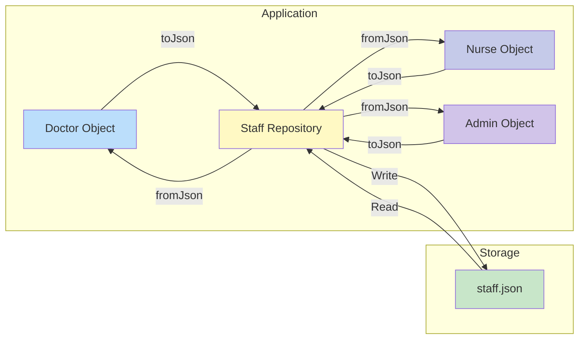

## 10. Staff Role Polymorphism

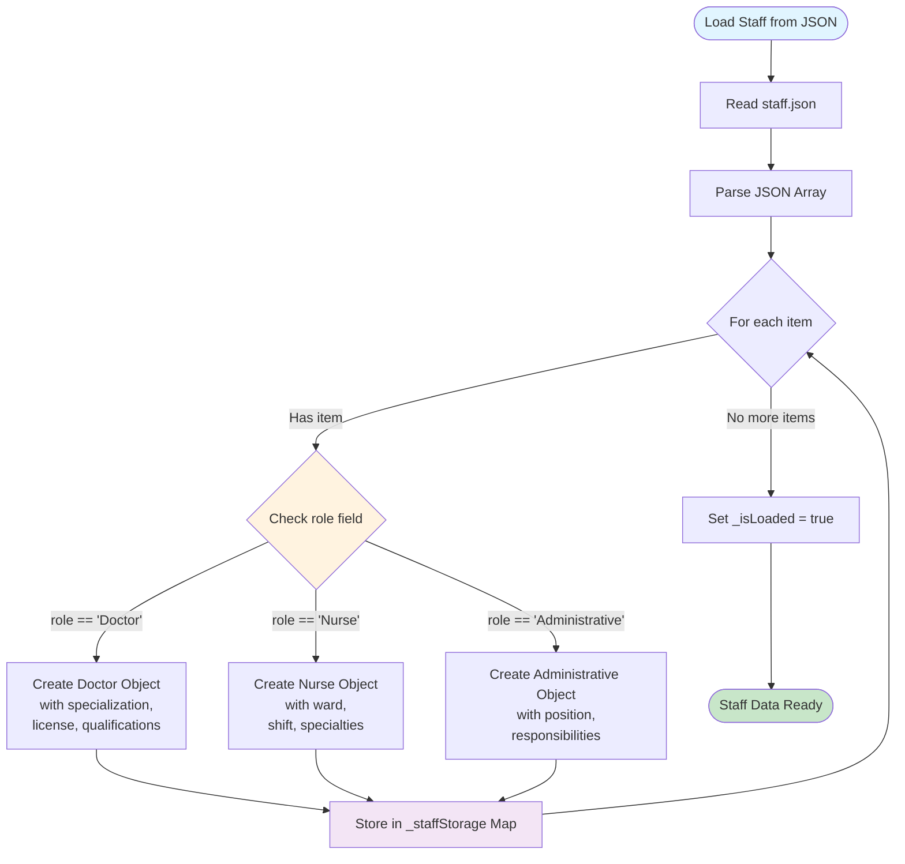

## 11. Complete Staff Management Architecture

```mermaid
graph TB
    subgraph UI["UI Layer (Console)"]
        ConsoleUI[ConsoleUI]
        StaffMenu[Staff Management Menu]
    end
    
    subgraph Service["Service Layer"]
        HospitalService[Hospital Service]
    end
    
    subgraph Domain["Domain Layer"]
        IStaffRepo[IStaffRepository Interface]
        Staff[Staff Abstract]
        Doctor[Doctor Entity]
        Nurse[Nurse Entity]
        Admin[Administrative Entity]
    end
    
    subgraph Data["Data Layer"]
        StaffRepo[StaffRepository Implementation]
    end
    
    subgraph Storage["Storage Layer"]
        JSON[staff.json]
    end
    
    ConsoleUI --> StaffMenu
    StaffMenu -->|hireStaff| HospitalService
    StaffMenu -->|getDoctors| HospitalService
    StaffMenu -->|getNurses| HospitalService
    
    HospitalService -->|uses| IStaffRepo
    HospitalService -->|creates| Doctor
    HospitalService -->|creates| Nurse
    HospitalService -->|creates| Admin
    
    IStaffRepo -.implements.- StaffRepo
    
    Staff <|-- Doctor
    Staff <|-- Nurse
    Staff <|-- Admin
    
    StaffRepo -->|read/write| JSON
    StaffRepo -->|manages| Staff
    
    style UI fill:#e1f5ff
    style Service fill:#fff3e0
    style Domain fill:#f3e5f5
    style Data fill:#e8f5e9
    style Storage fill:#fce4ec
```

## 12. Staff Performance Tracking

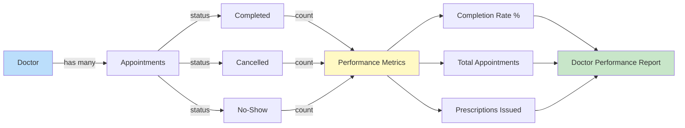

## Key Features Demonstrated

### 1. **Inheritance Hierarchy**
- Abstract `Staff` base class
- Three concrete implementations: `Doctor`, `Nurse`, `Administrative`
- Role-based polymorphism

### 2. **Repository Pattern**
- Interface-based design (`IStaffRepository`)
- Concrete implementation with JSON persistence
- Async data loading with `_ensureLoaded()` mechanism

### 3. **Data Flow**
- UI → Service → Repository → JSON
- Async/await throughout
- Error handling at each layer

### 4. **Business Logic**
- Staff hiring workflow
- Role-based filtering
- Performance tracking for doctors
- Appointment assignment

### 5. **Technical Solutions**
- Async constructor workaround
- Polymorphic JSON deserialization
- Type-safe operations with generics

## Usage in Presentation

These diagrams can be used to explain:

1. **Class Structure** - How staff hierarchy is designed
2. **Repository Pattern** - Data access abstraction
3. **Data Flow** - How operations flow through layers
4. **Workflows** - Hiring, viewing, searching staff
5. **Relationships** - Staff-Appointment-Patient connections
6. **Architecture** - Complete system overview

All diagrams are in Mermaid format and can be rendered in:
- GitHub README
- VS Code with Mermaid extension
- Online Mermaid editors (mermaid.live)
- Documentation tools (GitBook, Docusaurus)

