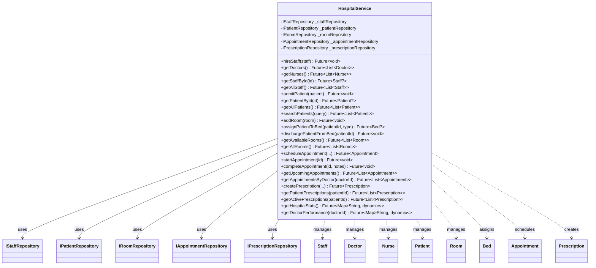

# Hospital Management System - UML Diagrams
**Clean Architecture Implementation with Private Encapsulation**

## 1. Class Diagram - Domain Entities

```mermaid
classDiagram
    %% Staff Hierarchy (Domain Entities - Pure Business Logic)
    class Staff {
        <<abstract>>
        -String _id
        -String _name
        -String _email
        -String _phoneNumber
        -DateTime _joinDate
        -String _department
        +String id
        +String name
        +String email
        +String phoneNumber
        +DateTime joinDate
        +String department
        +String role*
    }
    
    class Doctor {
        -String _specialization
        -String _licenseNumber
        -List~String~ _appointmentIds
        -List~String~ _qualifications
        +String specialization
        +String licenseNumber
        +List~String~ appointmentIds
        +List~String~ qualifications
        +String role
        +addAppointment(appointmentId) void
        +removeAppointment(appointmentId) void
        +addQualification(qualification) void
    }
    
    class Nurse {
        -String _ward
        -String _shift
        -List~String~ _specialties
        +String ward
        +String shift
        +List~String~ specialties
        +String role
        +addSpecialty(specialty) void
    }
    
    class Administrative {
        -String _position
        -List~String~ _responsibilities
        +String position
        +List~String~ responsibilities
        +String role
        +addResponsibility(responsibility) void
    }
    
    Staff <|-- Doctor
    Staff <|-- Nurse
    Staff <|-- Administrative
    
    %% Patient Entity
    class Patient {
        -String _id
        -String _name
        -DateTime _dateOfBirth
        -String _gender
        -String _address
        -String _phoneNumber
        -String _email
        -String? _emergencyPhone
        -String _bloodType
        -List~String~ _medicalHistory
        -List~String~ _appointmentIds
        -List~String~ _prescriptionIds
        -List~String~ _allergies
        -List~String~ _medicalConditions
        -DateTime _createdAt
        +String id
        +String name
        +DateTime dateOfBirth
        +String gender
        +String address
        +String phoneNumber
        +String email
        +String? emergencyPhone
        +String bloodType
        +List~String~ medicalHistory
        +List~String~ appointmentIds
        +List~String~ prescriptionIds
        +List~String~ allergies
        +List~String~ medicalConditions
        +DateTime createdAt
        +int age
        +addMedicalHistory(history) void
        +addAppointment(appointmentId) void
        +removeAppointment(appointmentId) void
        +addPrescription(prescriptionId) void
        +addAllergy(allergy) void
        +addMedicalCondition(condition) void
    }
    
    %% Room & Bed Entities
    class Room {
        -String _id
        -String _number
        -RoomType _type
        -int _capacity
        -double _pricePerDay
        -List~String~ _equipment
        -List~Bed~ _beds
        +String id
        +String number
        +RoomType type
        +int capacity
        +double pricePerDay
        +List~Bed~ beds
        +List~String~ equipment
        +int availableBedsCount
        +int occupiedBedsCount
        +int maintenanceBedsCount
        +getAvailableBed() Bed?
        +addEquipment(item) void
        +removeEquipment(item) void
    }
    
    class Bed {
        -String _id
        -String _roomId
        -int _bedNumber
        -BedStatus _status
        -String? _patientId
        -DateTime? _assignedDate
        -DateTime? _dischargeDate
        +String id
        +String roomId
        +int bedNumber
        +BedStatus status
        +String? patientId
        +DateTime? assignedDate
        +DateTime? dischargeDate
        +Duration? occupancyDuration
        +assignPatient(patientId) void
        +dischargePatient() void
        +setMaintenance() void
        +statusInternal BedStatus
        +patientIdInternal String?
        +assignedDateInternal DateTime?
        +dischargeDateInternal DateTime?
    }
    
    class RoomType {
        <<enumeration>>
        generalWard
        privateRoom
        icu
        emergency
        operatingRoom
        consultationRoom
        maternity
        +String displayName
    }
    
    class BedStatus {
        <<enumeration>>
        available
        occupied
        maintenance
    }
    
    Room "1" *-- "many" Bed : contains
    Room --> RoomType
    Bed --> BedStatus
    Bed ..> Patient : assigned to
    
    %% Appointment Entity
    class Appointment {
        -String _id
        -String _patientId
        -String _doctorId
        -DateTime _scheduledTime
        -String _reason
        -DateTime? _actualStartTime
        -DateTime? _actualEndTime
        -AppointmentStatus _status
        -String? _notes
        -String _appointmentType
        -DateTime _createdAt
        -String? _roomId
        +String id
        +String patientId
        +String doctorId
        +DateTime scheduledTime
        +String reason
        +DateTime? actualStartTime
        +DateTime? actualEndTime
        +AppointmentStatus status
        +String? notes
        +String appointmentType
        +DateTime createdAt
        +String? roomId
        +bool isUpcoming
        +bool isPast
        +bool isInProgress
        +bool canStart
        +Duration? duration
        +addNotes(notes) void
        +startAppointment() void
        +complete() void
        +cancel() void
        +markAsNoShow() void
    }
    
    class AppointmentStatus {
        <<enumeration>>
        scheduled
        inProgress
        completed
        cancelled
        noShow
    }
    
    Appointment --> AppointmentStatus
    Appointment ..> Patient : for
    Appointment ..> Doctor : with
    Appointment ..> Room : in
    
    %% Prescription & Medication Entities
    class Prescription {
        -String _id
        -String _patientId
        -String _doctorId
        -DateTime _issueDate
        -String _diagnosis
        -List~Medication~ _items
        -double _totalCost
        -String _instructions
        -DateTime? _followUpDate
        -bool _isFilled
        -String? _notes
        +String id
        +String patientId
        +String doctorId
        +DateTime issueDate
        +String diagnosis
        +List~Medication~ items
        +double totalCost
        +String instructions
        +DateTime? followUpDate
        +bool isFilled
        +String? notes
        +bool isValid
    }
    
    class Medication {
        -String _name
        -String _dosage
        -String _frequency
        -String? _notes
        -double _cost
        -bool _isValid
        +String name
        +String dosage
        +String frequency
        +String? notes
        +double cost
        +bool isValid
        +String dosageDescription
    }
    
    Prescription "1" *-- "many" Medication : contains
    Prescription ..> Patient : for
    Prescription ..> Doctor : by
```



## 2. Class Diagram - Repository Interfaces & Implementations


## 3. Class Diagram - Hospital Service (Business Logic)



## 4. Class Diagram - Console UI Layer


## 5. Clean Architecture Diagram

```mermaid
graph TB
    subgraph UI["🎨 Presentation Layer (UI)"]
        ConsoleUI[Console UI<br/>- User Interface<br/>- Input/Output Handling<br/>- Display Formatting]
    end
    
    subgraph Service["⚙️ Business Logic Layer (Service)"]
        HospitalService[Hospital Service<br/>- Business Rules<br/>- Workflow Orchestration<br/>- Data Validation<br/>- Transaction Management]
    end
    
    subgraph Domain["🏛️ Domain Layer (Pure Business)"]
        direction LR
        Entities["Domain Entities<br/>Staff, Doctor, Nurse, Administrative<br/>Patient, Room, Bed<br/>Appointment, Prescription<br/>(Private fields, Public getters)"]
        Interfaces["Repository Interfaces<br/>IStaffRepository<br/>IPatientRepository<br/>IRoomRepository<br/>IAppointmentRepository<br/>IPrescriptionRepository"]
    end
    
    subgraph Data["💾 Data Access Layer (Infrastructure)"]
        Repos["Repository Implementations<br/>StaffRepository<br/>PatientRepository<br/>RoomRepository<br/>AppointmentRepository<br/>PrescriptionRepository<br/>(JSON Serialization)"]
    end
    
    subgraph Storage["📁 Data Storage"]
        Files["JSON Files<br/>staff.json<br/>patients.json<br/>rooms.json<br/>appointments.json<br/>prescriptions.json"]
    end
    
    ConsoleUI -->|calls| HospitalService
    HospitalService -->|depends on| Interfaces
    HospitalService -->|uses| Entities
    Interfaces <-.implements.-o Repos
    Repos -->|read/write| Files
    
    style UI fill:#e1f5ff,stroke:#01579b,stroke-width:2px
    style Service fill:#fff3e0,stroke:#e65100,stroke-width:2px
    style Domain fill:#f3e5f5,stroke:#4a148c,stroke-width:2px
    style Data fill:#e8f5e9,stroke:#1b5e20,stroke-width:2px
    style Storage fill:#fce4ec,stroke:#880e4f,stroke-width:2px
    
    classDef cleanCode fill:#c8e6c9,stroke:#2e7d32
    class Entities,Interfaces cleanCode
```

**Key Principles:**
- ✅ **Dependency Rule**: Dependencies point inward (toward domain)
- ✅ **Private Encapsulation**: All entity fields are private with public getters
- ✅ **No JSON in Domain**: Serialization logic is in data layer only
- ✅ **Interface Segregation**: Clear repository interfaces in domain layer

## 6. Sequence Diagram - Schedule Appointment Flow


## 7. Sequence Diagram - View All Doctors Flow


## 8. Use Case Diagram


## 9. Component Diagram

```mermaid
graph TB
    subgraph UI["🎨 UI Layer"]
        ConsoleUI["ConsoleUI<br/>---<br/>• Main menu system<br/>• Input handling<br/>• Output formatting<br/>• User interaction"]
    end
    
    subgraph Service["⚙️ Service Layer"]
        HospitalService["HospitalService<br/>---<br/>• Business logic<br/>• Workflow coordination<br/>• Data validation<br/>• Transaction management"]
    end
    
    subgraph Domain["🏛️ Domain Layer"]
        direction LR
        
        subgraph Entities["Domain Entities"]
            Staff["Staff<br/>Doctor<br/>Nurse<br/>Administrative"]
            Patient["Patient"]
            Room["Room<br/>Bed"]
            Appointment["Appointment"]
            Prescription["Prescription<br/>Medication"]
        end
        
        subgraph Interfaces["Repository Interfaces"]
            IStaffRepo["IStaffRepository"]
            IPatientRepo["IPatientRepository"]
            IRoomRepo["IRoomRepository"]
            IApptRepo["IAppointmentRepository"]
            IPrescRepo["IPrescriptionRepository"]
        end
    end
    
    subgraph Data["💾 Data Layer"]
        direction LR
        StaffRepo["StaffRepository<br/>---<br/>• JSON serialization<br/>• _fromJson()<br/>• _toJson()"]
        PatientRepo["PatientRepository<br/>---<br/>• JSON serialization<br/>• _fromJson()<br/>• _toJson()"]
        RoomRepo["RoomRepository<br/>---<br/>• JSON serialization<br/>• _fromJson()<br/>• _toJson()"]
        ApptRepo["AppointmentRepository<br/>---<br/>• JSON serialization<br/>• _fromJson()<br/>• _toJson()"]
        PrescRepo["PrescriptionRepository<br/>---<br/>• JSON serialization<br/>• _fromJson()<br/>• _toJson()"]
    end
    
    subgraph Storage["📁 Data Storage"]
        StaffJSON["staff.json"]
        PatientJSON["patients.json"]
        RoomJSON["rooms.json"]
        ApptJSON["appointments.json"]
        PrescJSON["prescriptions.json"]
    end
    
    ConsoleUI -->|uses| HospitalService
    
    HospitalService -->|depends on| IStaffRepo
    HospitalService -->|depends on| IPatientRepo
    HospitalService -->|depends on| IRoomRepo
    HospitalService -->|depends on| IApptRepo
    HospitalService -->|depends on| IPrescRepo
    
    HospitalService -.->|uses| Entities
    
    IStaffRepo -.implements.- StaffRepo
    IPatientRepo -.implements.- PatientRepo
    IRoomRepo -.implements.- RoomRepo
    IApptRepo -.implements.- ApptRepo
    IPrescRepo -.implements.- PrescRepo
    
    StaffRepo <-->|read/write| StaffJSON
    PatientRepo <-->|read/write| PatientJSON
    RoomRepo <-->|read/write| RoomJSON
    ApptRepo <-->|read/write| ApptJSON
    PrescRepo <-->|read/write| PrescJSON
    
    style UI fill:#e1f5ff,stroke:#01579b,stroke-width:2px
    style Service fill:#fff3e0,stroke:#e65100,stroke-width:2px
    style Domain fill:#f3e5f5,stroke:#4a148c,stroke-width:2px
    style Data fill:#e8f5e9,stroke:#1b5e20,stroke-width:2px
    style Storage fill:#fce4ec,stroke:#880e4f,stroke-width:2px
```



## 10. State Diagram - Appointment Lifecycle

```mermaid
stateDiagram-v2
    [*] --> scheduled: Create Appointment<br/>(id: APT-{timestamp})
    
    scheduled --> inProgress: startAppointment()<br/>actualStartTime = now
    scheduled --> cancelled: cancel()
    scheduled --> noShow: markAsNoShow()
    
    inProgress --> completed: complete()<br/>actualEndTime = now<br/>calculate duration
    inProgress --> cancelled: cancel()<br/>(emergency)
    
    completed --> [*]
    cancelled --> [*]
    noShow --> [*]
    
    note right of scheduled
        ✓ Patient & doctor assigned
        ✓ Scheduled time set
        ✓ Status: scheduled
        ✓ isUpcoming = true (if future)
    end note
    
    note right of inProgress
        ✓ actualStartTime recorded
        ✓ Doctor with patient
        ✓ Status: inProgress
        ✓ isInProgress = true
    end note
    
    note right of completed
        ✓ actualEndTime recorded
        ✓ Notes added
        ✓ Duration calculated
        ✓ Status: completed
    end note
    
    note left of cancelled
        ✓ Status: cancelled
        ✓ Can be cancelled from<br/>  scheduled or inProgress
    end note
    
    note left of noShow
        ✓ Status: noShow
        ✓ Patient didn't show up
    end note
```



## 11. State Diagram - Bed Status Lifecycle


## 12. Deployment Diagram

```mermaid
graph TB
    subgraph UserMachine["💻 User Machine (Development/Production)"]
        Terminal["🖥️ Terminal/Console<br/>---<br/>• ZSH Shell<br/>• User I/O Interface"]
        
        DartVM["⚡ Dart VM<br/>---<br/>• Dart Runtime<br/>• Async Event Loop<br/>• Memory Management"]
        
        subgraph Application["📦 Hospital Management System"]
            direction TB
            BinDir["bin/<br/>hospital_management_system.dart"]
            LibDir["lib/<br/>---<br/>• domain/<br/>• data/<br/>• ui/"]
        end
        
        subgraph FileSystem["📂 File System"]
            DataDir["data/ directory<br/>---<br/>JSON Storage"]
            
            subgraph JSONFiles["JSON Files"]
                StaffFile["📄 staff.json<br/>(6 staff members)"]
                PatientFile["📄 patients.json"]
                RoomFile["📄 rooms.json<br/>(1 general ward)"]
                ApptFile["📄 appointments.json"]
                PrescFile["📄 prescriptions.json"]
            end
        end
    end
    
    Terminal -->|executes| DartVM
    DartVM -->|runs| BinDir
    BinDir -->|imports| LibDir
    
    LibDir <-->|read/write<br/>async I/O| DataDir
    DataDir --> JSONFiles
    
    StaffFile -.->|loaded into| StaffRepo[StaffRepository<br/>Memory Cache]
    PatientFile -.->|loaded into| PatientRepo[PatientRepository<br/>Memory Cache]
    RoomFile -.->|loaded into| RoomRepo[RoomRepository<br/>Memory Cache]
    ApptFile -.->|loaded into| ApptRepo[AppointmentRepository<br/>Memory Cache]
    PrescFile -.->|loaded into| PrescRepo[PrescriptionRepository<br/>Memory Cache]
    
    style UserMachine fill:#e3f2fd,stroke:#1565c0,stroke-width:3px
    style Terminal fill:#e1f5ff,stroke:#01579b,stroke-width:2px
    style DartVM fill:#fff3e0,stroke:#e65100,stroke-width:2px
    style Application fill:#f3e5f5,stroke:#4a148c,stroke-width:2px
    style FileSystem fill:#e8f5e9,stroke:#1b5e20,stroke-width:2px
    style JSONFiles fill:#fce4ec,stroke:#880e4f,stroke-width:2px
    
    style StaffRepo fill:#c8e6c9
    style PatientRepo fill:#c8e6c9
    style RoomRepo fill:#c8e6c9
    style ApptRepo fill:#c8e6c9
    style PrescRepo fill:#c8e6c9
```



**Deployment Notes:**
- **Platform**: Cross-platform (Linux, macOS, Windows)
- **Runtime**: Dart VM (async/await support)
- **Storage**: File-based JSON persistence
- **Architecture**: Single-process console application
- **Data Access**: Async I/O with in-memory caching
- **Startup**: Repositories auto-load data from JSON files

---

## Summary

### Architecture Highlights

✅ **Clean Architecture Compliance**
- Clear separation of concerns across 4 layers
- Dependencies point inward (toward domain)
- Business logic isolated from infrastructure

✅ **Encapsulation Excellence**
- All 53 entity attributes are private with public getters
- No direct field modification from outside
- Controlled state changes through methods

✅ **Domain-Driven Design**
- Rich domain models with business behavior
- Repository interfaces in domain layer
- No framework dependencies in domain

✅ **SOLID Principles**
- **S**ingle Responsibility: Each class has one reason to change
- **O**pen/Closed: Open for extension via inheritance (Staff hierarchy)
- **L**iskov Substitution: Doctor, Nurse, Admin are substitutable for Staff
- **I**nterface Segregation: Focused repository interfaces
- **D**ependency Inversion: Service depends on abstractions, not implementations

### Key Design Patterns

1. **Repository Pattern**: Data access abstraction
2. **Dependency Injection**: Repositories injected into service
3. **Factory Method**: Entity creation from JSON in repositories
4. **Template Method**: Common repository operations
5. **Strategy Pattern**: Different staff types with same interface

### Data Flow

```
User Input → ConsoleUI → HospitalService → Repository Interface → Repository Implementation → JSON File
          ←            ←                  ←                      ←                         ←
```

### Technology Stack

- **Language**: Dart 3.x
- **Paradigm**: Object-Oriented Programming with Async/Await
- **Persistence**: JSON file storage
- **Architecture**: Clean Architecture + DDD
- **UI**: Console-based (Terminal)
- **Testing**: `package:test` with unit and integration tests

---

**Document Version**: 2.0  
**Last Updated**: 2025-11-11  
**Project**: Hospital Management System  
**Architecture**: Clean Architecture with Private Encapsulation

